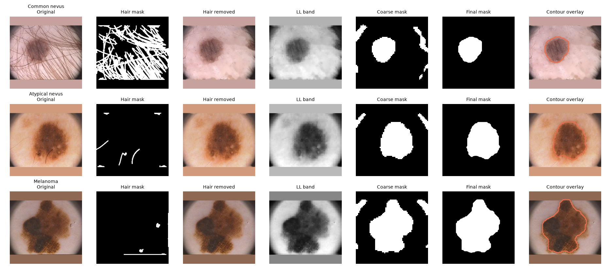
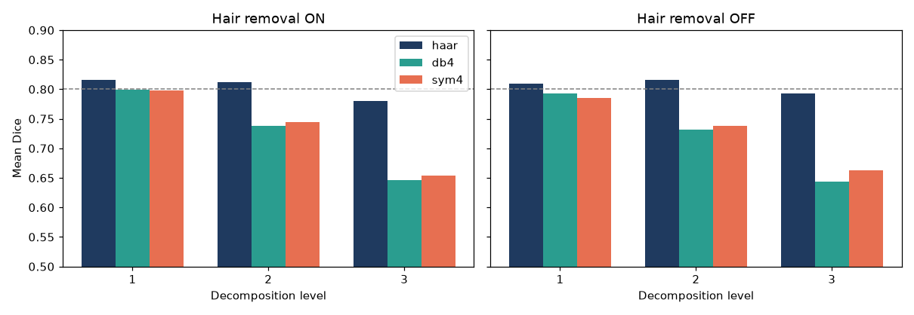
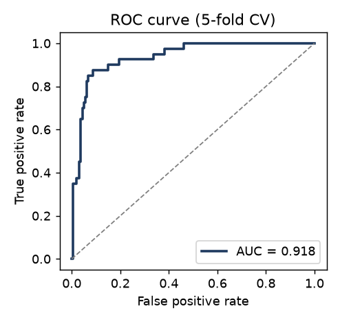
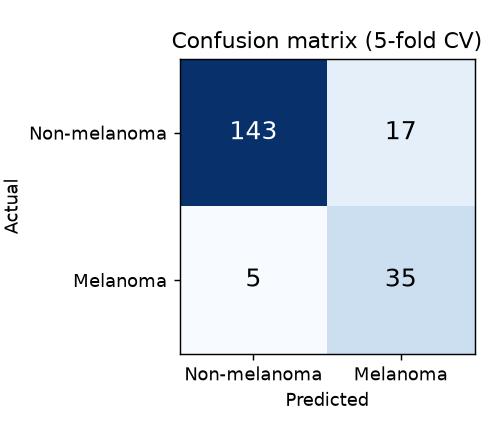
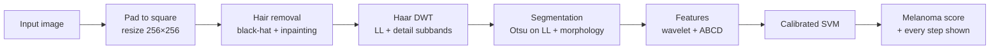

<div align="center">

# Skin Lesion Detection using Multiresolution Analysis

**An explainable, transform-based pipeline that segments skin lesions in dermoscopy images and scores them for melanoma, built on wavelets and mathematical morphology, with an interactive step-by-step demo.**


</div>

> **Educational project. Not a medical device.** It must not be used to diagnose or make decisions about
> real patients.



---

## Overview

Most recent melanoma-detection work relies on deep learning, which needs large datasets and GPUs and
cannot explain its decisions. This project takes the classical route and makes every step visible:

1. **Hair removal** with a morphological black-hat transform and inpainting.
2. **Multiresolution analysis** with the 2-D discrete wavelet transform (Haar, Daubechies db4, Symlet sym4) and Gaussian/Laplacian pyramids.
3. **Lesion segmentation** by Otsu thresholding of the coarse wavelet approximation, refined with morphology.
4. **Feature extraction**: wavelet energy/entropy texture features and clinical **ABCD** features.
5. **Classification** of melanoma vs. non-melanoma with a calibrated RBF support vector machine.

It also compares wavelet families, decomposition levels and hair removal systematically (18 configurations)
and ships a Streamlit app that shows each intermediate image, the extracted features and the prediction.

## Results

Evaluated on the public **PH2** dataset (200 dermoscopy images: 80 common nevi, 80 atypical nevi, 40 melanomas).
Default configuration: Haar wavelet, level 2, hair removal on. Classification uses stratified 5-fold
cross-validation repeated over 3 seeds.

| Metric | Result | Target |
|---|---|---|
| Segmentation, mean Dice | **0.812** | ≥ 0.80 |
| Segmentation, mean Jaccard | 0.712 | |
| Melanoma sensitivity | **0.85** ± 0.04 | ≥ 0.75 |
| Specificity | 0.84 ± 0.04 | |
| AUC | **0.918** | ≥ 0.80 |
| Analysis time per image (CPU) | 30–175 ms | ≤ 2 s |
| Full 18-configuration experiment grid | ~1 min | ≤ 15 min |

<table>
<tr>
<td align="center"><br><sub>Segmentation Dice by wavelet and level</sub></td>
<td align="center"><br><sub>ROC curve (5-fold CV)</sub></td>
<td align="center"><br><sub>Confusion matrix</sub></td>
</tr>
</table>

### Key findings

- **Haar segments best** (Dice 0.81). The longer db4 and sym4 filters fall to 0.65–0.75 at levels 2–3.
- **Hair removal** barely changes Dice (0.816 → 0.812) but improves classification slightly (AUC 0.901 → 0.918).
- **ABCD features alone** (AUC 0.930) perform as well as ABCD + wavelet texture combined (0.918); wavelet-only reaches 0.864. The wavelet features add explainable multiscale texture, not extra accuracy, on this dataset.
- **Melanomas are harder to outline** (Dice 0.62) than nevi (0.86): they are larger, more irregular and more textured.

<details>
<summary><b>Full experiment grid (hair removal on)</b></summary>

| Wavelet | Level | Dice | Jaccard | AUC | Sensitivity |
|---|---|---|---|---|---|
| Haar | 1 | 0.816 | 0.715 | 0.925 | 0.80 |
| **Haar** | **2** | **0.812** | **0.712** | **0.918** | **0.85** |
| Haar | 3 | 0.780 | 0.677 | 0.943 | 0.87 |
| db4 | 1 | 0.799 | 0.691 | 0.922 | 0.84 |
| db4 | 2 | 0.738 | 0.611 | 0.920 | 0.86 |
| db4 | 3 | 0.646 | 0.495 | 0.943 | 0.89 |
| sym4 | 1 | 0.798 | 0.688 | 0.927 | 0.86 |
| sym4 | 2 | 0.745 | 0.618 | 0.912 | 0.82 |
| sym4 | 3 | 0.654 | 0.506 | 0.916 | 0.84 |

All 18 configurations (including hair removal off) are in [`results/experiments.csv`](results/experiments.csv), and the
feature-set ablation is in [`results/feature_ablation.csv`](results/feature_ablation.csv). The default configuration was
fixed in advance rather than chosen from this grid.

</details>

## How it works



For the full theory (what the black-hat transform, the Haar transform, Otsu thresholding and the ABCD features are,
and why each is used) see [**HOW_IT_WORKS.md**](HOW_IT_WORKS.md).

## Getting started

### Prerequisites

- Python 3.12 or newer (the pinned library versions in `requirements.txt` need it; developed and tested on 3.14)
- The **PH2 dataset**, only needed for training and experiments. Request it from the [PH2 page](https://www.fc.up.pt/addi/ph2%20database.html) (free for research and education) and place it as:

  ```
  data/PH2/
  ├── PH2 Dataset images/      # one folder per case: IMD002, IMD003, ...
  └── PH2_dataset.txt
  ```

### Install

```bash
git clone <repository-url>
cd skin_lesion_mra
python3 -m venv .venv
.venv/bin/pip install -r requirements.txt     # Windows: .venv\Scripts\pip
```

### Train, then run the demo

```bash
.venv/bin/python train.py                     # features, CV metrics, models/model.pkl  (~10 s)
.venv/bin/streamlit run app.py                # opens http://localhost:8501
```

The app and the command-line runner need `models/model.pkl` but not the dataset. Stop the app with `Ctrl+C`.

The one-click sample buttons in the app (and the default image for `analyse_cli.py`) use three PH2 images that are
**not stored in this repository**. With the dataset in place, create them with
`.venv/bin/python make_figures.py`; without them the app simply hides the sample buttons and you can upload any image.
Step-by-step start/stop instructions and troubleshooting are in [**RUNNING.md**](RUNNING.md).

### Other commands

| Command | What it does |
|---|---|
| `.venv/bin/python analyse_cli.py <image>` | Run the backend on one image, no UI. Options: `--wavelet haar\|db4\|sym4`, `--level 1\|2\|3`, `--no-hair`, `--out DIR` |
| `.venv/bin/python experiments.py` | Run the 18-configuration grid and the feature-set ablation (~1 min) |
| `.venv/bin/python make_figures.py` | Regenerate report figures and the demo sample images |

## The demo app

Choose a sample or upload a dermoscopy image (JPG, PNG or BMP, at least 128×128 px, at most 10 MB), pick the wavelet,
level and hair-removal setting, then press **Analyse**.

- **Pipeline tab:** original → hair mask → hair removed → wavelet subbands (per level) → Gaussian/Laplacian pyramids → coarse mask → final mask → contour overlay.
- **Result tab:** prediction card with the melanoma score, ABCD feature table, subband energy chart and, for sample images, Dice against the expert mask.
- **About tab:** method, data, limitations and references.

The classifier is trained for one fixed configuration (Haar, level 2, hair removal on). If you pick other settings, the
displayed steps change but the prediction still comes from that default model, and the app says so.

## Project structure

```
skin_lesion_mra/
├── app.py                 # Streamlit UI only (no image processing)
├── analyse_cli.py         # backend on one image, no UI
├── train.py               # features → cross-validation → models/model.pkl
├── experiments.py         # 18-config grid + feature-set ablation
├── make_figures.py        # report figures + demo samples
├── config.py              # every tunable parameter in one place
├── src/
│   ├── dataset.py         # PH2 loader
│   ├── preprocessing.py   # validation, square padding, hair removal
│   ├── wavelet_utils.py   # DWT, Gaussian and Laplacian pyramids
│   ├── segmentation.py    # vignette suppression, Otsu on LL, morphology
│   ├── features.py        # wavelet and ABCD features
│   ├── classifier.py      # scaler + calibrated RBF SVM
│   ├── evaluation.py      # repeated stratified cross-validation
│   ├── metrics.py         # Dice, Jaccard, sensitivity, specificity
│   ├── pipeline.py        # analyse(): the one entry point used everywhere
│   ├── visualize.py       # report figures
│   └── errors.py          # InvalidImageError, NoLesionError
├── assets/                # app stylesheet (demo samples are generated here, git-ignored)
├── results/               # experiment tables and figures
└── models/                # trained model (created by train.py)
```

The design keeps one pipeline (`src.pipeline.analyse`) for training, experiments and the app, so features are always
computed the same way, and keeps all processing out of the UI layer.

## Configuration

Everything tunable lives in [`config.py`](config.py): wavelet and level, hair-removal threshold and kernel,
segmentation parameters, SVM settings, the decision threshold and the random seed (42).

Two choices worth knowing:

- **Decision threshold = 0.20**, the melanoma share of the dataset (40/200). The usual 0.5 cut-off missed about 40% of melanomas
  (sensitivity 0.55–0.62). It was set from this reasoning, not tuned on the results, trading more false alarms for fewer missed melanomas.
- **Segmentation parameters were tuned once on PH2** for the default configuration and then frozen.

## Limitations

- Only **40 melanomas**: sensitivity estimates are noisy (about ±4 points between cross-validation seeds).
- PH2 is a **single-source, mostly fair-skin** dataset. No external validation (for example on ISIC) has been done, so performance on other data is unknown.
- Lesion size is a strong cue in PH2 (melanomas tend to be larger), so the classifier may partly rely on it.
- Designed for **dermoscopy images**, not ordinary phone photographs. The app checks file type, size and whether a lesion-sized region is found, but not whether the image shows skin.
- The melanoma score is a model estimate, not a clinically calibrated probability.

## Future work

External validation on ISIC / HAM10000 · hybrid wavelet + CNN features · multi-class diagnosis · datasets with darker skin tones · a lightweight mobile screening app.

## References

1. R. Garnavi, M. Aldeen, and J. Bailey, "Computer-aided diagnosis of melanoma using border- and wavelet-based texture analysis," *IEEE Trans. Inf. Technol. Biomed.*, vol. 16, no. 6, pp. 1239–1252, 2012.
2. S. G. Mallat, "A theory for multiresolution signal decomposition: The wavelet representation," *IEEE Trans. Pattern Anal. Mach. Intell.*, vol. 11, no. 7, pp. 674–693, 1989.
3. N. Otsu, "A threshold selection method from gray-level histograms," *IEEE Trans. Syst., Man, Cybern.*, vol. 9, no. 1, pp. 62–66, 1979.
4. C. Barata, M. E. Celebi, and J. S. Marques, "A survey of feature extraction in dermoscopy image analysis of skin cancer," *IEEE J. Biomed. Health Inform.*, vol. 23, no. 3, pp. 1096–1109, 2019.
5. L. Talavera-Martínez, P. Bibiloni, and M. González-Hidalgo, "Hair segmentation and removal in dermoscopic images using deep learning," *IEEE Access*, vol. 9, pp. 2694–2704, 2021.
6. L. Yu, H. Chen, Q. Dou, J. Qin, and P.-A. Heng, "Automated melanoma recognition in dermoscopy images via very deep residual networks," *IEEE Trans. Med. Imaging*, vol. 36, no. 4, pp. 994–1004, 2017.

## License

Released under the [MIT License](LICENSE). The PH2 dataset is covered by its own terms (see below).

## Dataset

**PH2**: T. Mendonça, P. M. Ferreira, J. S. Marques, A. R. S. Marçal, and J. Rozeira, "PH² – A dermoscopic image database for research and benchmarking," *35th Annual International Conference of the IEEE Engineering in Medicine and Biology Society (EMBC)*, 2013.
Provided by the Universidade do Porto, Instituto Superior Técnico Lisboa and Hospital Pedro Hispano under its own terms of use. **The dataset is not included in this repository.**
The demo samples in `assets/samples/` are generated locally from PH2 by `make_figures.py` and are git-ignored; see the PH2 terms before redistributing any PH2 image.
